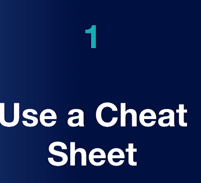
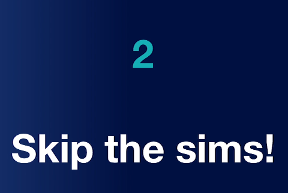
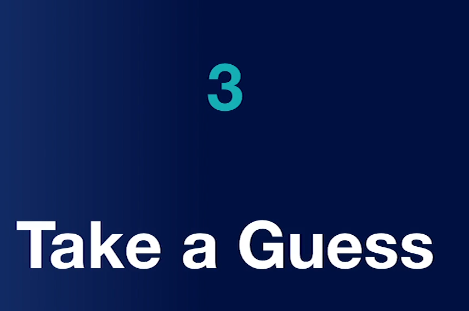
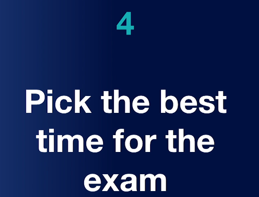
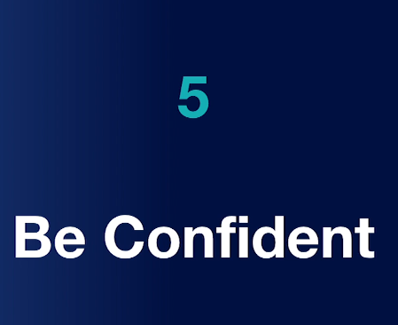


**Conclusion/Recap**

# 1)Attacks, threats, and vulnerabilities
**It makes up 24% of the questions on the exam**

#
# 2)Architecture and design
**It makes up 21% of the questions on the exam**

# 3)Implementation
**It makes up 25% of the questions on the exam**

# 4)Operations and incident response
**It makes up 16% of the questions on the exam**

# 5)Governance, risk and compliance
**It makes up 14% of the questions on the exam**

# 5 Tips

(Now actual cheating but the whiteboard provided to make notes at the first minutes of the exam)

(Skip the Sims and put these at the end)

(take a guess if you have doubts. There is no negative scoring)

(Best it suits you)

(Be confident)
