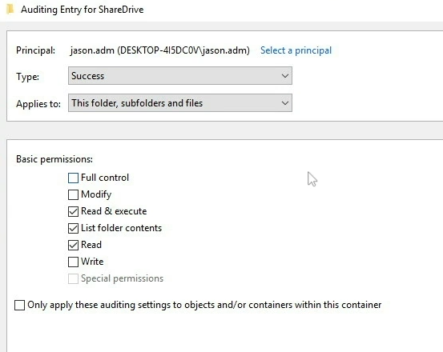
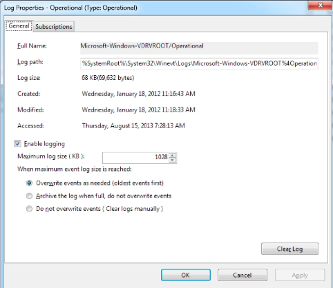

**Monitoring and Auditing**

# Monitoring
It's either:

1. Signature-based
1. Anomaly-based
1. Behavior-based

## Signature-based
Now, when we talk about signature-based monitoring, this is where your network traffic is analyzed for predetermined attack patterns. And so, if I said, every time you see somebody walk through the door who is five foot eight with brown hair and whose name is Jason, that's a signature. So, you would stop me at the door because I met that criteria.
## Anomaly-based
Now, when we do anomaly-based monitoring, we have to create a baseline of what normal is first. And once we established the baseline, then we can look at any other network traffic that starts following outside that baseline for further evaluation.

## Behavior-based
The third type we have is what’s known as behavior-based. Behavior-based is an activity that's going to be evaluated based on previous behaviors of the applications, the executables, and the operating system in comparison to the current activity of the system. Now, the problem with behavior-based analysis or behavior-based monitoring is that it tends to result in a lot of false positives because there's a large number of applications and lots of different relationships between those applications. If you think about your computer, how many different applications are installed? And how many ways do they talk to each other? You probably have Word, and PowerPoint, and Excel and Chrome, and Firefox, and maybe Outlook. And probably 50 or 60 other applications. For you to be able to create a good baseline for all those applications would take time.

# Baselining
Well, it’s a process of measuring changes in networking, hardware, software, or applications. If we know what the baseline is, what is normal, we can then see what is abnormal. Now, baselining our network is really important because it's going to define what normal is. By defining what normal is, it allows us to monitor for changes and report on those changes whenever we find something that's anomalous or abnormal.
## Baseline Reporting
Baseline reporting is the process of documenting and reporting on the changes that you find in a baseline. So, if I said that this computer was a Windows 10 machine with these five apps on it, and now you find that there are six apps, that is something we'd have to report because it's outside the normal baseline. We also have a baseline for the system that we create as part of our security posture.
## Security Posture
Now, a security posture is basically the risk level to which a system or other technology element is going to be exposed. 

One of the ways that most people use is a tool called Performance Monitor. It's a tool in Windows that you can use to monitor the performance of an individual server or workstation. You can check things like the processing power being utilized, the amount of memory being utilized, the amount of disk space, the network utilization, and other things like that. If you go to a command prompt and type in Perfmon and hit enter, it will bring up the performance monitor and you can see how your system is currently performing.
# Protocol Analyzer
They can be connected in either promiscuous mode, or non-promiscuous mode. If they're in **promiscuous** mode, that means the network adapter is going to be able to capture all of the packets on the network regardless of who the destination MAC address is. And this is going to allow them to capture all of the frames that carry that information. So, promiscuous, it doesn't matter if you're addressing it to me, I'm still going to collect it and listen to it. Now, if I'm in **non-promiscuous** mode, I'm only going to capture packets that are addressed directly to myself, the protocol analyzer. That's the difference with promiscuous versus non-promiscuous mode.

Now, to capture the most information, you're going to need to be put into promiscuous mode. Not all network adapters support this, so, you need to make sure you have one that does. Now, you also need to set up a port on the switch that is going to allow you to see all that traffic. Because in the old days of a hub, all that information was broadcast across every port. But with switches, everything is going based on the MAC address to specific ports based on its CAM table. So, to be able to get all that data, you need to be able to set up port mirroring.
## Port Mirroring
Port mirroring is where you have one or more switch ports that's configured to forward all of their packets to another port on the switch. This port is normally called a SPAN port. And it's being used to do port mirroring of all the other ports so that the protocol analyzer can see it.
## Network Tap
Now, sometimes you don’t have ability to configure the SPAN port yourself. Because maybe you're an analyst, but you're not a network administrator. If that's the case, you can also put in a network tap. Now, when you talk about a network tap, you have to really understand how a mirrored port works. When a mirrored port or a SPAN port is being used, it's using a logical method to replicate the traffic across all of the other ports on to that SPAN port. This does put a lot of additional processing requirements on the switches CPU, though. And it can slow down your network or cause packets to drop. If this is a concern, or you can't configure a SPAN port yourself, you can use a network tap instead, which is a physical device. A network tap is a physical device that allows you to intercept the traffic between two points on the network. So, maybe I want to put a network tap between the router and the switch at the boundary of the network. This is going to allow me to see everything that's coming in or out of the network that way. And it puts no additional load on the router or on the switch. I basically cut the cable in between, unplug it between the two devices, and put my device in between the two, and I get a copy of all of the data going between them. That's the idea with a network tap. Either can be used, either a SPAN port or a network tap to accomplish the same thing, but a network tap is going to be much more efficient because it is a physical device using the logical capability inside of the switch.

# SNMP
SNMP. SNMP is the Simple Network Management Protocol. It's a TCP protocol that aids in the monitoring of network-attached devices and computers. I want to remind you that SNMP is incorporated into network management and monitoring systems and it's heavily used in the concept of management and monitoring. SNMP is broken down into three components. There is the managed devices, the agent, and the network management systems themselves.
## Managed Devices
When we talk about managed devices, this is computers and other network-attached devices that are monitored through the use of agents by a network management system.
## The Agent
Agents are software that’s loaded onto a managed device and this allows us to redirect information to the network management system that's going to do the monitoring.
## Network Management Systems
And the Network Management System or NMS is the software that's run on one or more servers that controls the monitoring of all of the network-attached devices and computers across the network. 

SNMP is the glue that makes all three of these talk to each other using that SNMP protocol.

Now, when we talk about SNMP from a security standpoint, we need to think about the three different versions. There's version one, version two, and version three. Now, version one and version two are considered insecure because they use community strings to access a device. These are default community strings of public, which are read-only, or private, which allows read and write access to the devices and they are considered a fairly big security risk. For this reason, you should be using SNMP v3. SNMP v3 is a version of SNMP that provides integrity, authentication, and encryption of the messages being sent over the network.

# Demo-Analytic Tools

## Open Files

Now that it's on, we have to reboot this machine so that it will enable it to track all of the open files.

## Open Sessions

# Auditing
Auditing is essentially a detective control. We're looking to make sure everything was being done correctly, and if anything went wrong, we can go back and put together those pieces. Now, when you think about auditing, auditing can be conducted manually or using tools. For a manual audit, you're going to review the organization's security logs, access control lists, user rights and permissions, their group policies, their vulnerability scans, their written organizational policies, and you may interview personnel. When I think of auditing, especially on the exam, think of the fact that logs are part of auditing because those get tied together very frequently inside the auditing concept. Now, when we talk about auditing, there's also software tools that we can use to conduct auditing. Programs like the built-in auditing and logging features inside Windows and Linux are really useful, but there's also complex auditing suites available that you can buy as commercially available products.

# Demo Auditing

# Logging
Now, logs are simply data files that contain the accounting and audit trails for actions performed by a user on the computer or on the network.

If you’re looking for the logs on a Linux System, check the /var/log directory. 
Now, when we talk about this on a Windows System, there are three types of logs that you have to be familiar with. 
There are Security, System, and Application logs, and all three of those should be audited when you're looking at a Windows System. 

Now, **Security Logs** are logs for events such as successful and unsuccessful user logons to the system. 

Now, if we look at a **System Log** for instance, these are logs that have events such as a system shutdown or driver failure. So, if you're trying to investigate why that computer or server was shut down at midnight, you can go into the System Log and hopefully find out. 

Now, if you're having a problem with an application, you're going to look at the **Application Logs**. Application Logs are going to log the events for the operating system and third-party applications and so, those are the three types of logs you need to be aware of inside of Windows. 

Now, in Windows, if you want to view these log files, you're going to use the Event Viewer. Some logs like the System, Security, and the Application logs are going to exist on both work stations and servers. All of these can be accessed from the Event Viewer, but the Event Viewer isn't the most efficient way to view them. In fact, I much prefer a SYSLOG Server. This will allow you to consolidate all of the logs into a single repository and then you can use a SYSLOG Client to read through them and help correlate them.
## Syslog
SYSLOG is simply a standardized format for computer message logging that allows the separation of the software that generates the message, the system that stores them, and the software that reports and analyzes them. What does that really all mean? Well, when it comes to SYSLOG Servers, I can actually have different servers around the world, all sending their log files back to a single logging server. So, the DNS Server, the DHCP Server, the authentication server, and your client work station can all send their logs back to a centralized monitoring system, known as a SYSLOG Server. SYSLOG does this by sending all of that data back over UDP using port 514.
# Log Files
Now, when it comes to log files, where should they be saved? Well, I believe that log files shouldn't be saved on the same device that is being logged. So, if my server is being logged, I need to make sure those logs are actually being saved to a different partition, a separate hard disk, or to an external server. This means that if that server gets attacked or it crashes, the log files will still be safe so I can put together the pieces and figure out what happened. Now, in addition to that, you have to think about the size and scope of what you're logging, which I already talked about, right? If you log everything but you never move those log files off, you can actually have those files get so large that they overwhelm the system by eating up all of its resources and it can cause the server to crash. This can become another big issue, and so, it's really important to understand how you configure your logging. Another issue you have to consider is what do you do when the maximum log file size is reached? If you want to overwrite those events, this will allow you to overwrite the oldest events to make room for the newest events in the case that the maximum log file size is reached.

Log files should also be archived and backed up to ensure that they're always available when you need them.

Remember, if it’s on the server that’s been attacked, those log files could have been compromised, and so, we want to make sure those log files are constantly being pushed to a syslog server or to another backup server someplace else where we have good confidentiality and good integrity of those files. One way to ensure that is to use a write once, read many methods of data storage.

You should save your logs to an encrypted folder on the server, or better yet, to the backup server and have good file encryption being used on your backup and archival processes.

# SIEM
Security information and event management systems, SIEMs.

Now, a SIEM is a solution that provides real-time or near-real-time analysis of security alerts generated by network hardware and applications. Now, as we look at a SIEM, there's a lot of uses for one, but one of the best things they do is they help us correlate events.

A SIEM is a great place with a centralized repository of lots of different data. And so, it's a great place for auditors and analysts to look through as they're doing their analysis.

We’re going to cover things like Splunk, ELK, or Elastic Stack, ArcSight, QRadar, AlienVault and OSSIM, and GrayLog.

## Splunk
Splunk is a market-leading big data information gathering and analysis tool and it can import machine-generated data via a connector or a visibility add-on. Now, Splunk is really good at connecting lots of different data systems. In fact, it has different connectors built for most network operating systems and different application formats. Essentially, all the data from all the different systems can be indexed as it's taken off those systems and then written to a centralized data store. This allows Splunk to be able to go through historical or real-time data and be able to search through it using its proprietary search algorithms called the search processing language. Now, once you get those results, you can start visualizing it using different tools.

## ELK
Now, ELK and Elastic Stack is a collection of free and open-source SIEM tools that provide storage, search, and analysis functions. Now, ELK and Elastic Stack is actually made up of four different components. These are the Elasticsearch, which covers the query and analytics, Logstash, which is your log collection and normalization, Kibana, which does your visualization, and Beats, which is your endpoint collection agents that are installed on the machines. The way these all work together is you're going to have the different Beats installed on different servers or hosts. And they can then send out either directly back to the Elastic Stack, or it can go into Logstash first. Now, when it goes into Logstash first, it's going to do the parsing and the normalization for you and then send it into Elastic. If you go directly to Elastic, it has to be in a format that it already understands.
##
## ArcSight
ArcSight is a SIEM log management and analytics software that can be used for compliance reporting for legislation and regulations like HIPAA, SOX, and PCI DSS. When you look at ArcSight, it looks like another dashboard. And again, you can drill down into that information and display it in lots of different ways.
##
## QRadar
And QRadar is a SIEM log management, analytics, and compliance reporting platform created by IBM. It does a lot of the same stuff we've just talked about. And again, it comes with a nice dashboard.
##
##
##
##
##
##
## AlienVault and OSSIM
Our fifth one is Alien Vault and OSSIM, the open-source security information management system. Now, this is a SIEM solution that was originally developed by Alien Vault which is why it's called Alien Vault, but now it's owned by AT&T and they've been rebranding it recently as AT&T Cybersecurity. Just like the other ones, it does come with a dashboard where you can search and dig into the different information that could be presented here. Now, one of the nice things about Alien Vault and OSSIM is that OSSIM can integrate other open-source tools such as Snort IDs and OpenVAS vulnerability scanners and it can provide an integrated web administration tool for you to manage the entire security environment. So, it does give you this nice all-in-one solution. Also, because you're using a lot of open source tools here, it does keep your costs low.
##
## GrayLog
GrayLog is an open-source SIEM with an enterprise version that's focused on compliance and supporting IT operations and DevOps. And again, it has a nice dashboard where you can drill down and search for things. The big difference with GrayLog is that it's really focused on DevOps and supporting IT operations, as opposed to doing more of the log analysis and the incident response that some of the things like Splunk are much better suited for.

# Syslog
Now, Syslog is a protocol for enabling different appliances and software applications to transmit their logs or event records to a centralized server. Syslog is one of the things we talked about back when we talked about SIEMS because it was one of the protocols we could use to send data to the SIEM. Now, Syslog is going to follow a standard client server model and this is the de facto standard for logging of events from distributed systems across a network.
## Syslog message
It contains a PRI code, which is a priority code. It contains a header and it contains a message portion.

## Syslog Newer Implementations
1. First, newer implementations use port 1468 for TCP for consistent delivery. This way, if the network gets congested and that message can't get there, it will redeliver it over and over again because it's using TCP. 
1. The second improvement, newer implementations can use TLS or transport layer security to encrypt your messages being sent to servers. That way, that data in transit can't be read by somebody else on the network. It can only be read by the endpoint who sent it and the server who's receiving it. 
1. The third thing is that newer implementations also use MD-5 and SHA-1 to provide authentication and integrity. 
1. Additionally, we have this fourth thing, which is that some newer implementations can use message filtering, automated log analysis, event response scripting, and alternate message formats. 

   Now, this newer version of the server is usually called Syslog-ng for syslog next generation, or rsyslog. 

   Now, the final thing I want to mention about Syslog before we end this lesson is that Syslog is often used to mean three things. It can refer to the protocol that we send the data over, it can refer to the server as in a Syslog server, or it can refer to the log entries themselves as in Syslog data. People will often just say Syslog and they mean all three or any of these three, depending on the context. So, just be careful about that as you hear people talking in the industry to make sure you understand which one of the three they're talking about.

# SOAR
SOAR is an acronym and it stands for the Security Orchestration, Automation, and Response, also known as SOAR. This is a class of security tools that helps facilitate incident response, threat hunting, and security configurations by orchestrating and automating runbooks and delivering data enrichment. Basically, think about this as a SIEM version 2.0. Now, when you're dealing with SOAR, SOAR is primarily used for incident response, but there is a large part of it that's used for threat hunting, as well. But really, the number one place you're going to see SOAR used is incident response because it can automate so many of your actions. Now, as I said, I like to think about this as SIEM 2.0. Essentially, it's a next-generation SIEM. This takes a security information and event monitoring system and integrates it in with SOAR, and when you put those two together, this really does become your next-generation SIEM, just like when you deal with next-generation firewalls.

