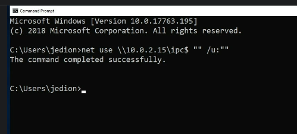

**Network Attacks**

# Ports/Protocols
There are **65,536 ports available** for your computer and your network to use.

## FTP
It's used to transfer files from host to host and operates over port 21 using TCP.

## FTPS
This is used to transfer files from host to host over an encrypted connection. By default, FTP doesn't provide any encryption and it sends everything in the clear. But with FTPS going over port 989 and 990, this is going to give us a TCP connection that is secured with an encryption tunnel and this is going to make it much more secure for us to send our files.

## SSH
It's used to remotely administer network devices and systems over port 22 using either TCP or UDP.

Also over port 22, we have secure copy called SCP and it's used to securely copy files over a network. 

Also on port 22, we have SFTP or secure FTP.

## Telnet
Telnet which is used to remotely administer network devices, but it doesn't provide any security. In fact, Telnet will send everything over the network in an unencrypted, clear text format, making it very dangerous for you to use.

For this reason, you should disable Telnet in your network. For the exam, remember that Telnet is operated over port 23 and uses both TCP and UDP.

## SMTP
It's used to send email over the Internet. It operates over port 25 using a TCP connection.

## SMTP Secure
Simple Mail Transfer Protocol over SSL or TLS. This is going to be used to send email over the Internet inside of an encrypted tunnel to make sure you maintain confidentiality. This is going to use one of two ports, either 465 or 587 and it's going to use it over a TCP connection. Just like we had HTTP and HTTPS, this is the same thing with SMTP and SMTP Secure.

## DNS
It's used to resolve host names to IPs and IPs to host names. When you look at something like diontraining.com and convert it to 184.168.131.241, this is DNS operating at work. DNS is going to operate over port 53 and uses both TCP and UDP connections.

## TFTP
It's used as a simplified version of FTP to put a file on a remote host or get a file from a remote host. It operates over port 69 using a UDP connection. It isn't one of the most secure types of file transfer but it is lightweight, so often it's used to boot a network operating system off of a server and onto a thin client.

## HTTP
It's used to transmit webpage data for a client over an unencrypted connection whenever you're browsing the Internet. HTTP uses port 80 and transmits using TCP.

## HTTPS
Hyper Text Transfer Protocol Secure which is what you're using to watch this course right now. It's used to transmit web pages to a client over an SSL or TLS encrypted connection. Essentially, this is the same thing as HTTP over port 80, except it's going to use an encrypted tunnel to secure that information and make sure nobody can see it. This is going to ensure confidentiality for us. HTTPS uses port 443 and a TCP connection.

## Kerberos
Our next one is Kerberos. Kerberos is used for network authentication using a system of tickets within a Windows domain. It operates using both TCP and UDP and operates on port 88.

## POP3
It's used to receive mail from a mail server. It operates over TCP port 110. This port is for the unencrypted POP3 services. We'll talk about the encrypted version later on.

## POP3 Secure
is used to receive email from a mail server using an SSL or TLS-encrypted connection. This is going to provide us better confidentiality by ensuring everything is encrypted. It's going to operate over port 995 over TCP.

## NNTP
Which is the Network News Transfer Protocol. It's used to transport Usenet articles to a client. It operates using TCP over port 119.

## RPC
The Remote Procedure Call and it's used to locate DCOM ports to request a service from a program on another computer over the network. This is commonly used in Windows-based networks and operates using both TCP and UDP over port 135.

## NetBIOS
It's used to conduct name querying, sending of data and other functions over a NetBIOS connection. This operates over three ports, 137, 138, and 139 using both TCP and UDP.

## IMAP 
or the Internet Message Access Protocol is used to receive email from a mail server with more features than your POP3 servers do. It's going to operate over port 143 using TCP when unencrypted.

## IMAP Secure
IMAP is the Internet Message Access Protocol and it's used to receive email from a mail server. But this time, we're going to do it over an SSL or TLS-encrypted connection. When we do that, we're going to use port 993 using TCP.

## SNMP 
is the Simple Network Management Protocol. It's used to remotely monitor network devices using a UDP connection over port 161. Now, we go to 162, this is the port reserved for SNMPTRAP. This is used to send Trap and InformRequests to the SNMP Manager on a network using both TCP and UDP connections.

## LDAP
Lightweight Directory Access Protocol. It's used to maintain directories of users and other objects. If you're using Active Directory inside a Windows environment, this relies on LDAP to function. LDAP will use port 389 over both TCP and UDP connections.

## LDAP Secure
LDAP over SSL or TLS operates over port 636 using either TCP or UDP.
## SMB
It's used to provide shared access to files and other resources over a network. It's going to operate on port 445 using a TCP connection.

## Syslog
Syslog is going to be used to conduct computer message logging, especially for routers and firewall logs. It operates over port 514 using UDP.

## Syslog Secure
is going to be used to conduct computer message logging, especially for routers and firewalls over a TLS-encrypted connection. Syslog over TLS operates on port 6514 using TCP.

## iSCSI
iSCSI is used for linking data storage facilities over IP. This is commonly used in storage area networks. iSCSI is going to operate on port 860 and it's using TCP.

iSCSI Target is a listening port for iSCSI-targeted devices when they're linking data storage facilities over IP. It's going to operate on port 3260 over TCP.

## MS SQL Server
Port 1433 which is used by the Microsoft SQL server to receive SQL database queries from its clients. This is going to use a TCP connection.

## RADIUS
RADIUS which is the Remote Authentication Dial-In User Service and it's used for authentication and authorization over port 1645 and accounting over port 1646. Now, these two ports are an alternative to its standard ports of 1812 and 1813. RADIUS operates using UDP.

## L2TP
Is our first VPN-related protocol. L2TP operates over port 1701 using UDP. L2TP stands for the Layer 2 Tunneling Protocol and is used as an underlying VPN protocol but has no inherent security. Because of this, if you use L2TP, you need to make sure that you're pairing it with IPsec to ensure you have good security.

## PPTP
Point-to-Point Tunneling Protocol. It's another underlying VPN protocol but this one, unlike L2TP, has built-in security. PPTP operates over port 1723 using both TCP and UDP connections.

## FCIP
FCIP or the Fibre Channel IP is used to encapsulate Fibre Channel frames within TCP/IP packets. This is usually used for storage area networks, as well. Now, FCIP operates over port 3225 over both TCP and UDP.

## RDP
the Remote Desktop Protocol which is used to remotely view and control other Windows systems via a graphical User Interface. It does this over port 3389 using both TCP and UDP. Now, be careful with this one because it's 3389 for RDP but 389 for LDAP and a lot of times, students will get those two confused.

## Diameter
Is a more advanced AAA protocol than RADIUS and it serves as a replacement for RADIUS. It also operates over port 3868 and it uses TCP as its connection mechanism.

# Unnecessary ports
Well, an unnecessary port is simply one that's associated with a service or a function that you don't need or is considered non-essential. For example, if you have a server whose entire function is to act as a mail relay server, all it's designed to do is send mail out, then the only thing it needs is a couple of ports open. It needs port 25 for SMTP and port 465 or 587 for SMTP over SSL and TLS. Now, every other port on that server can be shut or disabled or closed and you wouldn't care, because only those three ports are the ones you need. Remember, every open port represents an unnecessary vulnerability being left exposed if you didn't need to have that port open.

# DoS Attack
There are five subcategories of Denial of Service attacks:

1. Flooding Attacks
1. the Ping of Death
1. the Teardrop
1. the Permanent Denial of Service attack
1. the Fork Bomb

## Flood Attack
This is a specialized type of Denial of Service which attempts to send more packets to a single server or host than it can handle. So, in this example, we see an attacker sending 12 requests at a time to a server. Now, normally, a server wouldn't be overloaded with just 12 requests, but if I could send 12 hundred or 12,000, that might allow me to flood that server and take it down.

Now, under a Flood Attack we have a few different specialized varieties that you're going to come across on the exam.

The first is called a Ping Flood. This attack is going to happen when somebody attempts to flood your server by sending too many pings. Now, a ping is technically an ICMP echo request packet, but they like to call it a ping on the exam.

Next, we have a Smurf Attack. This is like a Ping Flood, but instead of trying to flood a server by sending out pings directly to it, the attacker instead tries to amplify this attack by sending a ping to a subnet broadcast address instead, using the spoofed IP of the target server. This causes all of the devices on that subnet to reply back to the victimised server with those ICMP echo replies, and it's going to eat up a lot of bandwidth and processing power.

The next kind of Flood Attack is what we call Fraggle. Fraggle is a throwback reference to the kids show Fraggle Rock from the 1980s which aired around the same time as the Smurf TV show. So, you can guess that Fraggle and Smurf are kind of related. Well, with Fraggle, instead of using an ICP echo reply, Fraggle uses a UDP echo instead. This traffic is directed to the UDP port of seven, which is the echo port for UDP, and the UDP port of 19, which is the character generation port. This is an older attack, and most networks don't have this vulnerability anymore, and both of these ports are usually closed, 'cause again, they're unnecessary. Notice that I didn't have them in your port memorization chart, either. Now, because of this, Fraggle attacks are considered very uncommon today. That said, a UDP Flood Attack, which is a variant of Fraggle, is still heavily used these days. It works basically the same way as a Fraggle attack, but it uses different UDP ports.

The next Flood Attack we're going to cover is a SYN Flood. Now, this attack is a variant on a Denial of Service attack, where the attacker is going to initiate multiple TCP sessions but never complete the 3-way handshake. You could see here, how the attacker is sending four SYN packets to the server, but they're using made up IP addresses. The server then replies to those IP addresses in an attempt to establish that 3-way handshake, but of course, the other people weren't expecting that call, and so, no one responds. This causes a server to set aside resources for these supposed clients while it waits for their response and acknowledgement, but the acknowledgement never comes. If the attacker creates enough requests, the server will simply run out of resources, and be unable to establish any real connections with those who really want to do business with the server, and this creates the Denial of Service condition.

Now, the final type of Flood Attack is known as a Christmas Attack. This is a type of attack that's conducted by setting the FIN, the PSH, and the URG flags inside a TC packet to the on position.This'll cause a device to crash or reboot anytime that packet's received because it's a nonstandard format. Now, this attack got its name from the way it looks when you look at these packets inside a protocol analyzer like Wireshark, because all of those flags are turned on, and it looks like a Christmas tree. Most devices today will simply block this type of attack and discard the packet because they don't understand how to handle it.

## Ping of Death
This attack sends an oversized and malformed ping packet to another computer or server. When it’s received, these systems don’t know what to do with it, and they would crash. This, again, is an older attack, and one that modern operating systems aren’t vulnerable to anymore. Now, essentially, the standard for a packet size is supposed to not exceed 65,535 bytes or 64k, but some smart attackers built ways to force larger packets to be sent. When they were received, this could override areas of system memory, much like a buffer overflow, or it would simply crash the machine. Why do we still cover the Ping of Death in Security+ when no one’s vulnerable to it anymore? Well, I think CompTIA likes to still cover it because of the history. The Ping of Death was one of the first types of Denial of Service attack that was really effective in the field.

## Teardrop Attack
Teardrop Attack, which breaks apart packets into IP fragments, modifies them with overlapping and oversized payloads, and sends them back to a victim machine. This gets its name because if you have enough teardrops, you could form a large puddle and, essentially, this attack attempts to create numerous smaller packets that can't be reformed into this larger puddle, and when they're trying to put those back together, the system simply crashes or reboots itself because it doesn't understand how to handle it. This will create the desired Denial of Service condition that the attacker was trying to create.

##
## Permanent Denial of Service attack or PDOS.
This is an attack which exploits a security flaw to permanently break a networking device by reflashing its firmware. This can cause a device to be unable to reboot itself because its operating system is overwritten. It's also called a Permanent Denial of Service attack because a quick reboot won't bring the system back online. Instead, the device has to be taken offline, have a full firmware reload done, and then it can be brought back online.

## Fork Bomb
With the Fork Bomb, the attacker creates a large number of processes to use up available processing power of a computer. This attack gets its name because a process is called a fork, and it can be forked into two processes, and then four processes and so on, until it eats up all of the resources. Now, some people think of this as a worm because of the self-replicating nature, but they're not a worm, because they don't infect programs, and they don't use the network to spread. Instead, Fork Bombs only spread out inside the processor's cache on a single computer that it's being attacked with, and it causes a Denial of Service attack, and a Denial of Service condition, which is why it's considered not to be a worm.

# DDoS
Now, a distributed denial of service attack, instead of using a single attack targeting one server, they use hundreds or even thousands of machines to launch an attack simultaneously against a single server, and force it offline to create that denial of service condition. Usually, these machines that conduct the attack don't even realize that they're a part of it, though. Generally, these machines have become zombies or bots inside a large botnet and then when they receive that command to attack, they all simultaneously send all their payloads against a single victim.

## DNS amplification
Now, in addition to most basic forms of DDoS attacks, there is one specific type of DDoS attack called a DNS amplification attack that could be performed. This specialized DDoS allows an attacker to generate a high volume of packets that's intended to flood a victim's website by initiating DNS requests from a spoof version of the target's IP address. This causes the DNS servers to respond to that request and send the response back to the server, thinking that it's valid. Because a DNS request uses very little bandwidth to send, but the response usually takes up a lot more bandwidth, this allows the attack to be amplified against the victim's server. Also, if this is happening because thousands of simultaneous requests are being made by a bunch of zombies and a botnet on behalf of your victim's server, you can easily become overwhelmed with a lot of information and eat up lots of bandwidth pretty quickly, causing that denial of service condition to occur.

## Methods to eradicate DDos
The first one is called **blackholing or sinkholing**. This technique identifies attacking IP addresses and routes all of their traffic to a non-existent server through a null interface. This effectively will stop the attack. Unfortunately, the attackers can move to a new IP and restart the attack all over again, and so, this is only a temporary solution. Intrusion prevention systems can also be used to identify and respond to denial of service attacks. This can work for small-scale attacks against your network, but you're not going to have enough processing power to handle a large-scale attack or a big DDoS. Now, one of the most effective methods to utilize is to have an elastic cloud infrastructure. If you've built your infrastructure so that it can scale up when demand increases, you can ride out a DDoS attack.

# Spoofing
Spoofing is a category of network attacks that occur when an attacker masquerades as another person by falsifying their identity. Just like a person uses a mask to cover up their face to hide their true identity, spoofing is the electronic equivalent. We have briefly discussed spoofing a few times already, such as in the case of the DNS amplification attack when attempting a distributed denial of service by spoofing the IP address of the victim server when making that request.

# Hijacking
Is the exploitation of a computer session in an attempt to gain unauthorised access to data, services, or other resources on a computer or server. There are eight types of session hijacking that can be performed. Session theft, TCP/IP hijacking, blind hijacking, clickjacking, Man-in-the-Middle, Man-in-the-Browser, the watering hole attack, and cross-site-scripting attacks.

## Session Theft
With session theft, the attacker is going to guess the session ID for a web session and that enables them to takeover the already authorised and established session of that client.

## TCP/IP Hijacking
` `it can also occur at the network or transport layer, too. Now, when it does, it's called TCP/IP hijacking because it occurs when an attacker takes over a TCP session between two computers without the need of a cookie or other host access. Because TCP sessions only authenticate during the initial three-way handshake, the attacker can jump into the session at any time they want if they can guess the next number in the packet sequence.

## Blind Hijacking
Now, the next type of hijacking is called blind hijacking because it occurs when the attacker blindly injects data into a communication stream and won't be able to see the results whether they're successful or not.

## Clickjacking
This attack uses multiple transparent layers to trick a user into clicking on a button or link on a page when they were intending to click on something else. Basically, the hyperlink to the malicious content is hidden under some legitimate clickable content. So, you think you're clicking on an image and you're actually clicking on some link that takes you elsewhere.

## Man-in-the-Middle Attack
A Man-in-the-Middle attack causes data to flow through the attacker's computer where it can then be intercepted or manipulated as it passes through. This is considered an active type of interception. So, let's pretend that you've got some kind of malware on your computer and now all of your traffic is going to route through this attacker's machine.

## Man-in-the-Browser
Man-in-the-Browser is very similar to the Man-in-the-Middle, except it's limited to your browser's web communication instead of looking at the entire communication. This can occur because you have a Trojan that's infected your vulnerable web browser and it modifies web pages or transactions that are being done within that browser.

## Watering Hole
And a watering hole is something that we described all the way back in the beginning of this course. It occurs when malware is placed on a website that the attacker knows his potential victims are going to access. Now, this can also be modified to allow for session hijacking too because the attacker can take over that website and grab the information between your client and the server itself.

## XSS
Finally, we have cross-site scripting which we've also discussed before. Now, I'm mentioning it here briefly because cross-site scripting is another way that you can use this vulnerability to conduct session hijacking against a victim. It does this by targeting that client's computer and tricking it into thinking the code came from a trusted web server. And if you can trick it successfully, then the client is going to execute that code and this can give that attacker a hijack place inside that communication stream.

# Replay Attack
A replay attack is a network-based attack where valid data transmissions are fraudulently or maliciously re-broadcast, repeated, or delayed. This works a lot like a session hijack but it's a little bit different. With a session hijack, the attacker is trying to modify the information being sent and received at real time, but with a replay attack, we're simply trying to intercept it, analyse it, and decide whether or not to let it be passed on later again.

One place where replay attacks have been used quite successfully, though, is in the world of wireless authentication. By capturing a device's handshake onto the wireless network, you can replay it later to gain access to that network yourself as if you were them. This is extremely common in the older protocols, especially the wired equivalent privacy or WEP when using a wireless network. So, you should be using the latest protocols like WPA2 to help prevent and minimise your risk.

# Null Session
Well, a null session is a connection to the Windows interprocess communications share known as the IPC dollar sign. This is an administrative share that you don't see as a normal user, but it allows computers across the network to send information that they know about files, folders, users, groups, computers, and servers to each other. Now, as an attacker, if you're able to create a null connection to a computer, you can use that as part of your information gathering and enumeration and be able to use all of that data as part of your follow-on attack.

# Transitive Attacks
Transitive attacks aren’t really an actual type of attack but more of a conceptual method. It gets its name from the Transitive Property we learned back in mathematics. Essentially, the Transitive Property says that if A equals B and B equals C, then by all logic, A also equals C. Now, when it comes to Security+, and they talk about the idea of a transitive attack, they're really focusing on the idea of trust. If one network trusts a second network and that second network trusts a third network, then that first network really trusts the third network, and so, if an attacker can get into any one of those three networks, he can then get into the other two, as well. This is based on that transitive trust. This is really important in the world of security because whoever you trust, you're also trusting everyone else that they've ever trusted.

# DNS Attacks
There are four different DNS attacks that you have to know for the Security+ exam. There're DNS poisoning, unauthorised zone transfers, altered hosts files, and domain name kiting.
## DNS Poisoning
Now, DNS poisoning occurs when the name resolution information is modified in the DNS server's cache. This modification of the data is done to redirect client computers to fraudulent or incorrect websites, usually as part of follow-on attacks. Now, DNS poisoning usually occurs on a company's internal DNS servers instead of on public-facing DNS servers around the Internet. With this type of attack, the internal client on the network has to make a request to go to a website like diontraining.com and whenever they make that request, the client first checks with their local network's primary DNS server to see if it knows the IP address for that URL. If someone has gone there recently, that IP address is already going to be stored in the local cache, but if the cache was poisoned, that user is now going to be redirected to a malicious website instead of the desired one. To counteract DNS poisoning, secure DNS also known as DNSSEC, has been created. DNSSEC uses encrypted digital signatures when passing DNS information between servers to help protect it from poisoning. You can also prevent your DNS servers from being poisoned by ensuring that you're running the latest patches and the latest updates to make sure it's protected.
## Unauthorised Zone Transfer
to provide DNS data to a zone transfer which replicates information to other servers. With an unauthorised transfer, though, an attacker requests a copy of that zone transfer information and if they receive it, they now have a list of all of your server names and IP addresses and this helps them plan for future attacks. Because of this, zone transfers should always be restricted between two known and trusted servers only and not let other people ask for zone transfers.
## Altered Host Files
The third type of DNS attack is focused on the client itself. Every computer and workstation has a file on it called the host file. The host file is a plain text file and it contains IP addresses and names. This is a reference that the operating system is going to check every time a DNS lookup is requested prior to going to a DNS server. So, if the host file has a domain name being requested, it's simply going to provide the host file version of that DNS information instead of going out to a DNS server requesting it.
## Pharming
Pharming occurs when an attacker redirects one website's traffic to another website that is bogus or malicious. This is done by poisoning the DNS or by modifying the host file on a system. Anyway you do it, if you're trying to redirect somebody to another website that's usually considered pharming.
## Domain Name Kiting
Now, our final attack is called domain name kiting. This attack exploits the way that the registration process works for a domain name. Normally, you're given a five-day grace period when you're adding a domain name, but if you delete it before that five days is up and you re-add it again, the five days restarts. So, this lets an attacker gobble up domain names without ever having to pay for them. And they can just keep them in this limbo state. This is more of an abuse of the system than a real attack but it does prevent a legitimate buyer from obtaining that domain name and so, we do consider it an attack in the Security+.

# ARP Poisoning
Now, ARP stands for the address resolution protocol, like you learned back in Network+, and it's used to convert an IP address into a MAC address. If you remember back from Network+ and our OSI model lesson, as data moves down the OSI stack, it uses IP addresses to transmit packets all over the world from router to router. But once it finds the right router, that router converts that IP address into a MAC address and passes it on to the switches inside of its own network, and that is going to help it to deliver the information using frames inside the data link layer. 

Now, ARP poisoning is going to exploit the way that an ethernet network works. It's going to enable an attacker to steal, modify, or redirect frames of information on the network. The concept here is that the attacker is going to associate their MAC address with the IP address of another device within the network. This way, whenever the router asks for the MAC address that's associated with that IP, they get the attacker's MAC address instead of the legitimate user's. This allows the attacker to essentially take over any session that would involve MAC addresses at the layer two of the OSI model. 

To prevent ARP poisoning, you should set up good VLAN segmentation within your network, and also set up DHCP snooping to ensure that IP addresses aren't being stolen and taken over by an attacker.

