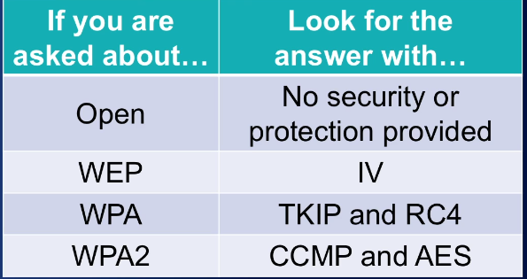
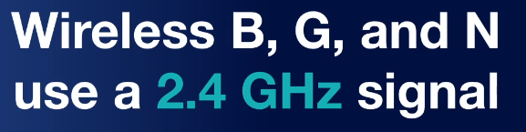

**Securing Networks**

# Securing Network Devices
- Default accounts
- Default device username
- Weak passwords
- Privilege Escalation
- Backdoor
- Network attacks

# Securing Network Media
Network media is the cabling that makes up our network. This can be copper, fiber optic, or coaxial. And they're going to be used as a connectivity method inside of our wired networks. Now, in addition to all the cables, there's other parts of the cabling plant we have to think about. All those intermediate devices like patch panels, punch-down blocks, and network jacks all make up this cabling plant that runs throughout our organisation.

## EMI
This stands for electromagnetic interference. Electromagnetic interference is a disturbance that can affect electrical circuits, devices, and cables due to radiation or electromagnetic conduction that occurs. Now, EMI is something that happens normally inside our businesses and inside our homes. EMI is caused by all sorts of things, like televisions, microwaves, cordless phones, baby monitors, motors like inside your vacuum, and other devices.

Now, to minimize EMI, you need to install shielding around the source, for instance, your air conditioner lets off a lot of EMI. You could put shielding around that. Or you can shield the cable itself by choosing shielded twisted-pair. Now, STP cables, or shielded twisted-pair, have foil around either each twisted-pair in the cable or around the entire bundle of twisted-pairs to prevent emanations out of the cable or interference entering into the cable. STP gives you double benefit, it keeps things out, and it keeps things in.

## RFI
RFI is just another type of interference like EMI. Like EMI, it's a disturbance that can affect your electrical circuits, your devices, and your cables. But instead of being caused by electrical waves, it's caused by radio waves. Most often from AM and FM transmission towers or cellular phone towers. Now, cell towers and radio towers near your office can be a big source of RFI in your wireless networks.

## Crosstalk
Another vulnerability we have is what’s known as crosstalk. Crosstalk occurs when a signal is transmitted on one copper wire, and it creates an undesired effect on another copper wire. So, when we think about having two copper wires, like inside of a twisted-pair cable, if the shielding inside that protects those wires comes off, then we can actually have crossover from one wire to another. And that causes interference because of the data emanations and EMI. Crosstalk is essentially that, but in very close proximity.
## Data Emination
Well, data emanation is the opposite. It comes from inside your cable, and it starts generating a field around that cable, that when you're transmitting information over the network, could be picked up by somebody who's trying to capture that. This is things on your network trying to escape. So, if somebody is nearby, they can actually capture those data emanations, and they could reconstruct that data that was travelling over your network.
## Split Wires
Now, if you can’t find an open jack but you still want to collect things completely passively, you can do this by splitting the wires of a twisted-pair connection. You can open up the cable in an area that nobody is seeing. You can cut the wire and solder on additional wires to each of the twisted-pair's internal cables. This will give you a copy of the data and you can plug it back in and give the network a copy of the data. This lets you capture the data as it transmits back and forth over the network completely passively, and no one's going to see it.
## PDS
To prevent this, you can install a protected distribution system, or a PDS. A PDS is a secured system of cable management to ensure that the wired network remains free from eavesdropping, tapping, data emanations, and other threats. They are kind of expensive, though, because they add locks to every network closet. They enclose every cable distribution point. And they run cables through a protected conduit that runs throughout the ceiling. Because of this expense, I've only really seen this used in very large organisations that are really worried about security, government buildings, or the military.
# Securing Wifi Devices
## SSID
It takes me about five seconds to find out your SSID if you're not broadcasting. So, by disabling it, you're just making operations harder for yourself and you're not really gaining any security here. Now, all of that said, if you're asked on the exam, disable SSID broadcast is considered good security in the Security+ exam and you should implement it.
## Rogue Access Point
A rogue access point is an unauthorised wireless access point or wireless router that somebody connected to your network and it's going to give access to your secure network. For example, if you walk around your office and somebody decided that they didn't want to plug into that RJ45 jack all the way in the back wall over there, so, they put a wireless access point so they can access it throughout the whole room. That makes operations easy for them, but that wireless access point wasn't properly configured. This is going to extend your wired network into the wireless realm, and it can introduce its own DHCP server and cause all sorts of other issues. To prevent this, you should enable MAC filtering on the network, network access control, and run a good IDS or IPS on your network that can detect or prevent these devices when they initially try to connect.
## Evil Twin
An evil twin is a rogue, counterfeit, and unauthorised wireless access point that's broadcasting on the same SSID that your broadcast is. So, for example, if I went to Starbucks, you can go and connect and there's Starbucks' Wi-Fi. You know, Starbucks' free Wi-Fi and I can connect my laptop and I can get on the Internet. That's great, that's what all these people here are doing. Now, if I go and sit in the back corner, and I turn on my laptop and I start broadcasting as Starbucks' free Wi-Fi and I broadcast louder and stronger than Starbucks' own access point, I can have you connecting to me instead of connecting to them. I'm the evil twin. Now, by doing that, I can then be in the middle of your communications, acting as a man in the middle, collecting all of your information and seeing everything that goes on.

# Wireless encryption
## WEP
WEP is the Wired Equivalent Privacy. This came from the original 802.11 wireless security standard, and it claimed to be as secure as a wired network. I'm going to prove this wrong to you, in our demonstration later, because we're going to brute force WEP, and break it in about three minutes.  WEP was originally used with a static 40-bit pre-shared encryption key, but later it was upgraded to a 64-bit key, and then, again, to a 128-bit key. This isn't the main problem with WEP, though. The main problem is a 24-bit Initialization Vector, or IV, that it uses in establishing the connection, and it's sent in clear text.
## WPA
WPA is the Wi-Fi Protected Access standard. It uses a Temporal Key Integrity Protocol, or TKIP, which uses a 48-bit Initialization Vector instead of the 24-bit Initialization Vector used by WEP. The encryption that it uses is the Rivest Cipher 4, or RC4, and it added Message Integrity Checking, or MIC. And it uses all of this to make sure that the data is secure, and ensuring that it's not modified in transit. Overall, it's a pretty good standard, but it does have some flaws, and so version 2 was released to fix those.
## WPA2
WPA version 2, or Wi-Fi Protected Access version 2 was created as part of the 802.11i standard to provide stronger encryption and better integrity checking. The integrity checking is conducted through CCMP, which is the Counter Mode with Cipher Block Chaining Message Authentication Code Protocol. And the encryption uses AES, the Advanced Encryption Standard. AES supports a 128-bit key or higher, and WPA2 uses either a personal mode, with pretty short keys, or an enterprise mode, with centralised authentication via a radio server, or another centralised server, to handle that password distribution we were talking about.

## WPS
WPS is the Wi-Fi Protected Setup, which was designed to make setting up new wireless devices easier. For example, if you have a new printer you want to configure, you'd push a button on your wireless access point, you'd push a button on the printer, and you'd enter a PIN number, and boom, those devices would do a handshake, they would pass over the secret credentials, and both would now be encrypted. This is great, but, it was horribly executed. WPS relies on an eight-digit code, but when they sent that code, they actually break it up into two four-digit chunks. This takes something that would have been eight-digits long, and, essentially, makes it four-digits long. And that makes it a lot easier to brute force, because each four-digit chunk only has 10,000 possible combinations. Your computer and my computer can go through 10,000 combination pretty darn quickly, and brute force that password.
## Never trust Wifi
Finally, in addition to using the WPA2 standard for your encryption, you should also set up a VPN for your wireless devices. Anytime you connect to a Wi-Fi, even your own, you should always use a VPN to protect the data that's going across it. Never, never, never, never, never trust a wireless network. If you use one, you should always have a VPN. This is an encrypted tunnel inside of this encrypted wireless tunnel that adds security. Trust me, encryption and VPNs are your friend on the Security+ exam. They're almost never the wrong answer. Those two things come up time and time again. Remember, you can have an encrypted WPA2 tunnel, and then put a VPN encrypted inside of it. That gives you two layers of encryption and makes your wireless networks much, much more secure.

# Wireless Access Points

So, how do you determine what signals are around your office that may be causing jamming or interference? Well, you can do this by conducting a wireless site survey, using a tool like Netstumbler, or you can pull out a spectrum analyzer. This will allow you to see what frequencies are in use and how strong they are to see if they're having an effect on your network. Now, most wireless access points do have some built-in security features that you can configure, as well. This includes things like a basic firewall with stateful packet inspection, MAC filtering, different levels of encryption that we've already talked about, and the ability to disable your SSID broadcast. Some more advanced wireless access points, though, also feature access point isolation. Access point isolation creates a network segmentation between each client that's connecting to the access point, and it prevents them from communicating with any other client and only allows them direct access to the network's resources or the Internet.

# Wireless Attacks
## War driving
War driving is the act of searching for wireless networks by driving around until you find them. You could try this tonight. You can go sit in the backseat of your car, have your friend or your wife drive you around the neighbourhood and see which networks you can connect to.
## Warchalking
The next type of attack is called war chalking. War chalking is the act of physically drawing symbols in public places to denote the open, closed, or protected networks that are in range. It gets its name because in the early days, people would actually take chalk and draw on a telephone pole different symbols to tell other people what it is.
## IV Attack
An IV attack occurs when an attacker observes the operation of a cipher being used with several different keys and they find this mathematical relationship between those keys to determine the clear text data. Now, I know that sounds really complicated, but the good news is you don't have to do the math to do it. There's programs that do it for you. This happened with WEP because of that 24-bit initialization vector.
## Wi-Fi disassociation attack
This is going to target an individual client that's connected to the wireless network. It's going to force it offline by sending deauthentication packets to it, and then it's going to capture the handshake that that client makes when it attempts to reconnect. This is used as part of an attack on WPA or WPA2. Our final attack is known as a brute force attack.
## Brute Force
A brute force attack occurs when an attacker continually guesses at a password until they finally get the correct one. So, an example of this might be that you have the password of dog, and I know that your password is three characters long. So, I start out guessing AAA, AAB, AAC, and I keep going until I get to DOF and finally DOG, dog, I've found your password.

# Demo

# WPA3
Now, WPA3 has an equivalent cryptographic strength of 192-bits when you're using it in Enterprise Mode, now, that means it is much stronger than we had in WPA2. Now, as we move into WPA3, we have two different modes, we have the Enterprise Mode mentioned here and we have Personal Mode.

When we talk about WPA3-Enterprise Mode, we're talking about the business use case and this gives you additional security. It's going to use an AES algorithm with 256-bits of encryption and it's going to use a SHA-384 hash for integrity checking. 

When you look at WPA3-Personal Mode, it uses CCMP-128 and that means it's using a 128-bit key inside of an AES algorithm inside CCMP. Now, this is the minimum encryption required for secure connectivity within Personal Mode. Now, when we start talking about WPA3, what was really the big change here, besides increasing the cryptography a little bit by increasing those key sizes, there was one really big improvement and it's the removal of the Pre-Shared Key exchange. 

Now, if you remember when we talked about WEP and WPA and WPA2, we talked about the fact that they all had this Pre-Shared Key and when we exchange that key over the network, we could have a man-in-the-middle attack or somebody snooping and grab that key out and then crack it. Now, with WPA3, that's not possible because we've removed that key exchange, instead, we use what's known as a Simultaneous Authentication of Equals or SAE. This is a secure password-based authentication and password-authenticated key agreement method. Now, by doing this, what we end up doing is using this thing known as forward secrecy.

# Other Wireless Technologies
## Bluetooth
Bluejacking sends information to a device where Bluesnarfing takes information from a device.

## RFID
RFID devices have an embedded radio frequency signal that's used to transmit identifying information about the device or the token to a reader that's trying to pick it up. RFID refers to a large category of devices and technologies, but, for the exam, the specifics of RFID are not that important. Instead, you need to focus on the fact that RFID devices can send information from a card to a reader to provide authentication or identification. For example, one of the most common devices that we use RFID for is a card that looks like a credit card.

## NFC
Near Field Communication or NFC allows two devices to transmits information when they're in close proximity to each other. This occurs using an automated pairing process and transmission process of that data. For example, some cellphones have the ability where you can touch the cellphones together to pass photographs back and forth. Other uses of NFC are commonplace in payment systems. For example, I have an iPhone, and I can hold it over a credit card terminal to pay with my credit card that's linked through Apple Pay. This is an example of a Near Field Communication device. Just like RFID, we do have to worry about the possibility of interception of that wireless information, though, because it could be replayed and rebroadcast.

## Others
Now, there’s a few other types of wireless communication out there. For example, your cellphone uses cellular data networks as part of its communication. This might be 2G, 3G, 4G or even LTE. All of these are a type of wireless network. As I said before, your employer should use cellular over wireless whenever possible because cellular is a point-to-point connection between your device and the cellphone tower.

## GPS
This time, I want to focus on GPS from the vulnerability that system has if your organisation relies upon it. For example, if you use GPS as a way for you to know where all of your devices are and how your devices are going to drive around a parking lot, you need to worry a little bit because GPS relies on your device being able to receive a GPS signal from three of 24 satellites that are orbiting around the planet. Your device then uses that information to calculate your position. This signal, though, is very weak as it transmits all the way down from the satellite down to Earth. If a malicious attacker wanted to disrupt that communication, it doesn't take very much power to jam the GPS signal. Therefore, if your organisation relies upon GPS, you need to design your IT systems to not rely solely on GPS, but instead, have some sort of back up function especially if you're using it for critical navigation or other functions.

## Satellite
Satellite communication is used for long-distance communicating over large distances in areas that other networks may not be around. You may use this to connect to viewer networks or connect yourself to the Internet. Satellite is heavily used in areas that other normal communication networks simply can't reach. For example, if you're the adventurous type and you're climbing a mountain in a remote area of the world, it's unlikely that they have a fiber optic cable or cellphone service up there. But you could bring a satellite phone with you and you could still remain connected and be able to reach back to the ground stations, in case an emergency happens. Another area that satellites are commonly used for is for merchant mariners. As they're traveling around the oceans, they don't have any fiber optic lines in the middle of the Pacific, and so, they have to use satellite as a way to reach back to shore.

